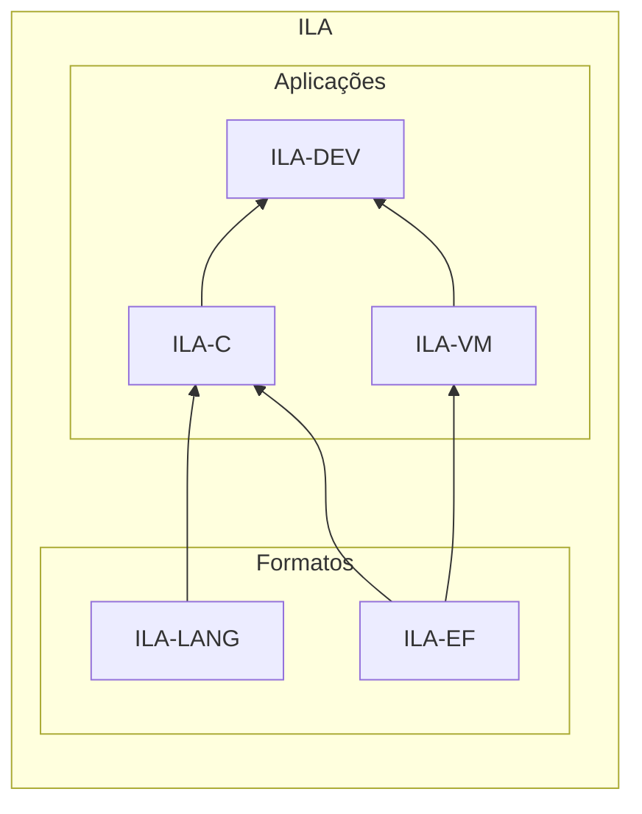

# Proposta

O ILA é um projeto de ambiente de programação voltado para iniciantes falantes da língua portuguesa, com ênfase na acessibilidade para usuários com deficiências visuais.

O objetivo é a implementação de uma IDE, um ambiente completo de desenvolvimento, para uma linguagem de programação com tokens em português. A IDE deve permitir o desenvolvimento e execução de programas escritos nessa linguagem, com funcionalidades que permitam o uso confortável de todas as funcionalidades do ambiente para deficientes visuais.

A IDE do ILA deverá ser uma aplicação gráfica, para que o seu uso seja mais confortável para programadores iniciantes. A aplicação deverá ser multiplataforma, podendo ser executada em ambientes desktop(Linux e Windows) e também na Web(navegadores).

## Estrutura do projeto

Prezando pelas boas práticas de desenvolvimento e engenharia de software, o projeto deverá ser implementado como um conjunto de aplicações separadas, que quando utilizadas juntas, são capazes de oferecer as funcionalidades propostas.

O projeto será composto pelas seguintes aplicações:

- **ILA-DEV**:
	O ambiente de desenvolvimento gráfico, com funcionalidades de acessibilidade para deficientes visuais.

- **ILA-LANG**:
	A linguagem de programação na qual os usuários do ILA escreverão seus programas.

- **ILA-C**:
	O compilador que implementará a ILA-LANG, que deverá emitir código executável no formato ILA-EF.

- **ILA-EF**:
	O formato de código executável utilizado pelas aplicações do projeto ILA.

- **ILA-VM**:
	A maquina virtual multiplataforma, que executará o código no formato ILA-EF produzido pelo ILA-C.

